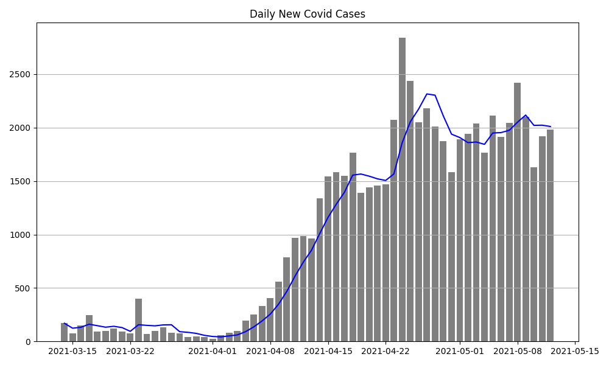

## Thailand Covid Data

A Jupyter Notebook to create graphs of Thailand Covid-19 data,
including new cases, hospitalizations, and deaths.



[Open Notebook on Github](https://github.com/fatalaijon/covid-th/blob/master/covid.ipynb)
or
[](https://colab.research.google.com/github/fatalaijon/covid-th/blob/master/covid.ipynb)

One of the plots raises errors when run in Google Colab, but they work fine on my
computer using Linux and Jupyter 4.7.0 with IPython 7.16.1 and Python 3.6.9.

If you fix this problem, please email me or open an issue or Pull Request on Github.


### Source of Data

The Thailand Department of Disease Control provides data through a free API.
* Home page <https://covid19.th-stat.com/>
* API reference <https://covid19.th-stat.com/en/api> (for Thai use "th" instead of "en")

The URLs are:

* <https://covid19.th-stat.com/api/open/timeline> daily reports since 1/1/2020, including daily and cumulative values for: confirmed cases, recovered, hospitalized, and died. JSON format
* <https://covid19.th-stat.com/api/open/today> today's report, same format as the timeline (above).
* <https://covid19.th-stat.com/api/open/cases> data for each case, including gener, nationality, province, district, date confirmed, and quarantine date (if any).  Reverse chronological order. Dataset is **large** due to redundant encoding of both Thai and English for fields and use of full location names instead of codes. JSON format.
* <https://covid19.th-stat.com/api/open/area> a single JSON record containing the following (including typo and unnecessary backslashes):

```json
{"Data": [],
 "Source": "https:\/\/ddc.moph.go.th\/viralpneumonia\/",
 "DevBy": "https:\/\/www.kidkarnmai.com\/",
 "SeverBy": "https:\/\/smilehost.asia\/"
}
```

The `timeline` file for 1 May 2021 contains the following, reformatted for readability.
The actual file is all one line with no space between fields.
```json
{"UpdateDate": "01\/05\/2021 11:42",
 "Source": "https:\/\/covid19.th-stat.com\/",
 "DevBy": "https:\/\/www.kidkarnmai.com\/",
 "SeverBy": "https:\/\/smilehost.asia\/",
 "Data": [
   . . .
   {"Date": "05\/01\/2021",
    "NewConfirmed": 1891,
    "NewRecovered": 1821,
    "NewHospitalized": 49,
    "NewDeaths": 21,
    "Confirmed": 67044,
    "Recovered": 38075,
    "Hospitalized": 28745,
    "Deaths": 224}
  ]
}
```

Another source of Covid data for Thailand is [Our World in Data](https://ourworldindata.org/coronavirus/).  The URL for Thai data is <https://ourworldindata.org/coronavirus/country/thailand>, but I don't see how to download for only a specific country.

### Pandas Syntax Used

The daily Covid data is inside a JSON object with key 'Data'.  We want to use that to create the Panda DataFrame (rather than everything in the timeline file).

1. Read the file and create a JSON object:
   ```python
   import json

   with open("data/timeline.json","r") as f:
        all_data = json.load(f)
   ```
2. Create a DataFrame object from records in the 'Data' element of the JSON object:
   ```python
   import pandas as pd

   covid = pd.DataFrame.from_records(all_data['Data'])
   ```

The columns (fields) in this dataframe are:
```
Date             60 non-null     object
NewConfirmed     60 non-null     int64
NewRecovered     60 non-null     int64
NewHospitalized  60 non-null     int64
NewDeaths        60 non-null     int64
Confirmed        60 non-null     int64
Recovered        60 non-null     int64
Hospitalized     60 non-null     int64
Deaths           60 non-null     int64
```

### Transforming data

The `Date` field is just a string. Convert it to a timestamp using:
```python
covid['Date'] = pd.to_datetime(covid['Date'])
```

The observations have only a date value, the time part is always 0:00:00.
So a "date" is better than a Timestamp.

Pandas Series class has a [transform](https://pandas.pydata.org/docs/reference/api/pandas.Series.transform.html) method with syntax:
```python
result: Series = series.transform(func, axis=0, *args, **kwargs)
```
where `func` is a function to apply to each element in the series.  `*args` and `**kwargs` are passed to the `func`.

To transform Timestamp to Python datetime.date use:
```python
dates = covid['Date'].transform(pd.Timestamp.date)
```
instead of saving the result as separate Series object, we save it as a new column in the `covid` DataFrame.

### Date as Index Variable

For a time series its better to use the dates or timestamps as index variable (instead of an arbitrary integer). This makes it easier to access date ranges and combine data from multiple files. The DataFrame constructor and pd.read_xxx methods have optional parameters to automatically convert strings to dates and set the index column:
```python
df = pd.read_csv('timeseries.csv',
                 parse_dates=['Date','Another-Date'], # columns to convert to dates
                 index_col='Date'  # name of column containing dates for index
                 )

# If there is only one date column, can use this abbreviated syntax
df = pd.read_csv('timeseries.csv',
                 index_col='Date', # name of column for index
                 parse_dates=True  # parse date strings in the index column
                 )
```

When you do this, there won't be a `'Date'` column in the DataFrame, but you can access the dates using `.index`:  
```python
df.index.values  # displays all values 
print("Starting date is", df.index.start)
```

### Formatting Dates and Tick Mark Spacing

The creators of the Thai Covid data use American style date format mm/dd/yyyy
instead of the more typical dd/mm/yyyy as used in Thailand. Weird. Pandas seems to detect this and convert dates correctly.

When plotting the data, the pandas plot methods put too many tick labels
on the x-axis and display the full datetime object as "2021-01-04 00:00:00". 

Fixes are:
* convert Timestamp to date
* use a DateFormatter
* specify frequency of major tick labels


Good reference is part of a free course on time series:
<https://www.earthdatascience.org/courses/use-data-open-source-python/use-time-series-data-in-python/date-time-types-in-pandas-python/customize-dates-matplotlib-plots-python/>

The two methods used are:
```python
fig, ax = plt.subplots(...)

# another good format is "%F" (yyyy-mm-dd)
date_format = matplotlib.dates.DateFormatter("%m-%d")
ax.xaxis.set_major_formatter( date_formatter )

# interval=1 means 1 tick label each week
ax.xaxis.set_major_locator(matplotlib.dates.WeekdayLocator(interval=1)
```

where `ax` is a reference to the plot.  There is also a `set_minor_formatter` method.

Another, older reference: <https://izziswift.com/pandas-timeseries-plot-setting-x-axis-major-and-minor-ticks-and-labels/>


### Graphs and Charts

To create graphs from a Pandas dataset, you can use Pandas interface to Matplotlib, or use Matplotlib directly.

Using Pandas (`covid` is a DataFrame object):
```python
covid.plot.line(x='Date', y=['NewConfirmed', 'New Hospitalized'],
                ylabel='Daily Cases', title='Daily New Cases')
```

using Matplotlib, specify the series to plot:
```python
plt.title('Daily New Cases')
plt.plot(covid['Date'], covid['NewConfirmed'], color='blue', ...)
plt.grid(axis='y')
```

Pandas `dataframe.plot` provides a concise interface, but its often not clear how to create plots the way I want. Matplotlib has a more flexible interface and better [documentation][matplotlib-docs].

[matplotlib-docs]: https://matplotlib.org/stable/contents.html


### Formatting Dates and Tick Mark Spacing

The creators of the Thai Covid data use American style date format mm/dd/yyyy
instead of the more typical dd/mm/yyyy as used in Thailand. Weird. Pandas seems to detect this and convert dates correctly.

When plotting the data, the pandas plot methods put too many tick labels
on the x-axis and display the full datetime object as "2021-01-04 00:00:00". 

Fixes are:
* convert Timestamp to date
* use a DateFormatter
* specify frequency of major tick labels


Good reference is part of a free course on time series:
<https://www.earthdatascience.org/courses/use-data-open-source-python/use-time-series-data-in-python/date-time-types-in-pandas-python/customize-dates-matplotlib-plots-python/>

The two methods used are:
```python
fig, ax = plt.subplots(...)

# another good format is "%F" (yyyy-mm-dd)
date_format = matplotlib.dates.DateFormatter("%m-%d")
ax.xaxis.set_major_formatter( date_formatter )

# interval=1 means 1 tick label each week
ax.xaxis.set_major_locator(matplotlib.dates.WeekdayLocator(interval=1)
```

where `ax` is a reference to the plot.  There is also a `set_minor_formatter` method.

Another, older reference: <https://izziswift.com/pandas-timeseries-plot-setting-x-axis-major-and-minor-ticks-and-labels/>


### Graphs and Charts

To create graphs from a Pandas dataset, you can use Pandas interface to Matplotlib, or use Matplotlib directly.

Using Pandas (`covid` is a DataFrame object):
```python
covid.plot.line(x='Date', y=['NewConfirmed', 'New Hospitalized'],
                ylabel='Daily Cases', title='Daily New Cases')
```

using Matplotlib, specify the series to plot:
```python
plt.title('Daily New Cases')
plt.plot(covid['Date'], covid['NewConfirmed'], color='blue', ...)
plt.grid(axis='y')
```

Pandas `dataframe.plot` provides a concise interface, but its often not clear how to create plots the way I want. Matplotlib has a more flexible interface and better [documentation][matplotlib-docs].

[matplotlib-docs]: https://matplotlib.org/stable/contents.html
